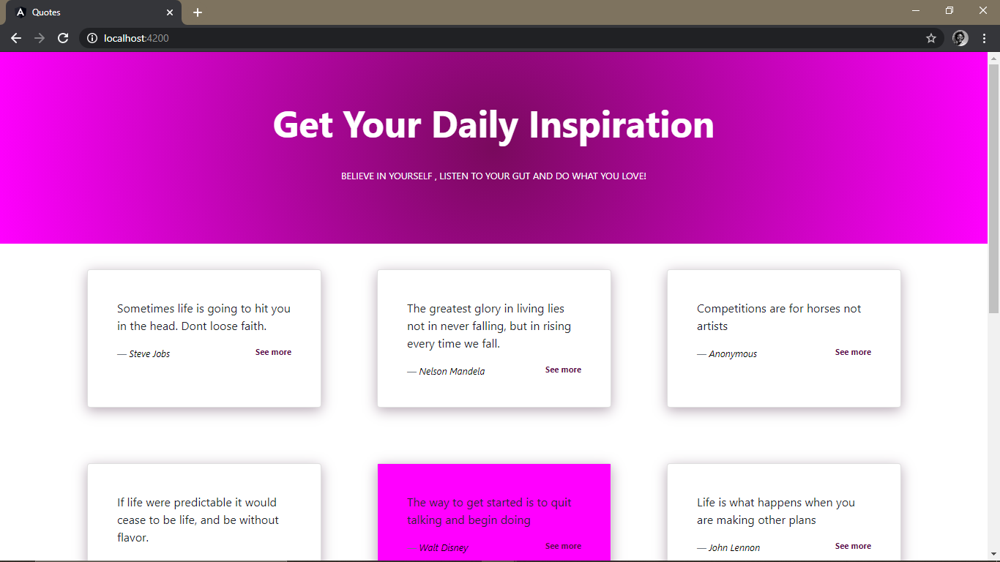
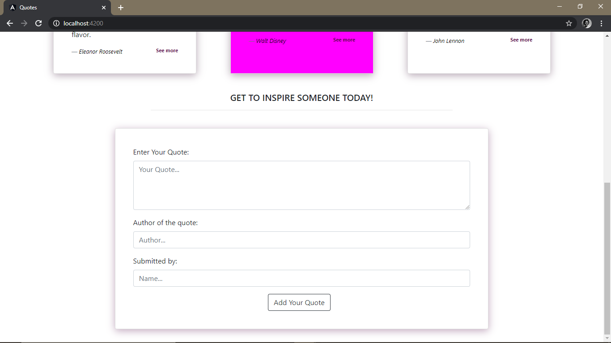

# Quotes-App
#### An application where users can upload quotes and have those quotes voted on , 9/27/2020.
#### By Felista Kiriinya

## Description
An application that allows users to upload quotes. The quotes can then be up voted, down voted and/or deleted. 

## Ready To be inspired or inspire?
Here's what you need to do:

- Visit the website at 
- Read and get inspired from the quotes you find below
- You can also add your own quotes on the app in the form below the quotes
- You get to see the quote posted on the page
- You can like or dislike the quotes you find there or the one you manage to add
- You get to see the quote with the highest likes highlighted in a purple background color.

## Development
To make advancements/modifications, follow these steps:

- Fork the repository
- Create a new branch (`git checkout -b improve-feature`)
- Make the appropriate changes in the files
- Add changes made
- Commit your changes (`git commit -am 'Improve feature'`)
- Push to the branch (`git push origin improve-feature`)
- Create a Pull Request 

## Figma Design
This is the link to the [figma](https://www.figma.com/file/d8PPqcL1OoKZI8EqJzfqNS/QUOTES-APP?node-id=0%3A1) design.

## Technologies Used

This project was generated with [Angular CLI](https://github.com/angular/angular-cli) version 12.18.3.
The technologies used are HTML, CSS, Typescript and Bootstrap.

## Support and contact details

Should you be unable to access the website, have any recommendations and/or questions, feel free to email me:[felkiriinya@gmail.com](mailto:felkiriinya@gmail.com)

## To-do
1. Store quote entries in a database
2. Improve functionality of voting buttons to ensure one can only like OR dislike a quote

##[License]()

Copyright (c) 2020 [Felista Kiriinya]()
